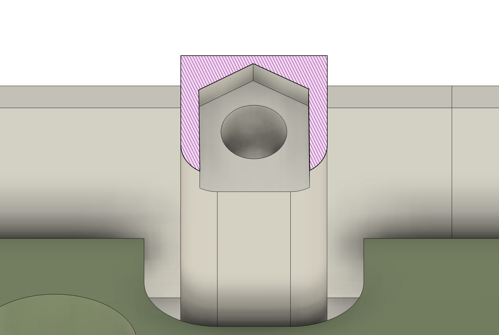

# batoid

_A 3D-printable, handwired, ergonomic keyboard_

## Small footprint, big personality

Kotte Computer Electronics is proud to present the latest revolution in ergonomic personal computing peripherals - the Batoid Erlanomic keyboard.

The tilted, split layout of 43 staggered keys with an incline of 8 degrees is designed with your optimal performance in mind.

The two built in LED indicators conveniently show what side of the keyboard you are typing on, and blinks in a forwards-and-back manner during high typing speeds.

The bottom row features one extra key, this gives you the opportunity to add an easily accessible extra modifier.

The case is held together with M3 nuts and bolts, and the 3D-printed plate is mounted with a 3-5mm sealing strip, giving you a comfortable, bouncy typing experience with materials found at your local hardware store.

The Kotte Computer Electronics Batoid allows you to maximize your productivity and enjoyment, at work and home.

## Inspiration

I've wanted an Alice-like 40's board for quite a while, so when @theerland on the Swedish MK-Discord server said he onted one too, inspiration struck.

The name Batoid comes from the fact that it looks a bit like a member of the batoidea family of fish. [Here's one I met a couple of years ago](./kotte-with-batoid.png). It's pretty happy, and blinks it's eyes when you type - a feature that is completely useless, but cute as shit.

## Some more beautyshots, by Erland

## Some not as beautiful (but informative) CAD shots

## Bill of materials

- 43 switches with MX footprint
- 43 diodes
- 1 Pro Micro
- A length of 3-5mm sealing strip with P profile
- 8 M3 nuts and bolts
- 2 5mm LED's (preferrably with built in resistors)
- 4 rubber feet
- CA glue
- Tiny ZIP tie for the MCU (usually not needed, but nice to have just in case)

## Building

The keyboard comes in a number of parts, split up to fit on a regular home-size 3D printer with minimal supports. Depending on your printer it can be a good idea to print it with brims.

- The top case parts are meant to be printed upside down, without supports.
- The bottom case parts are meant to be printed right side up.
- Take an extra look at the plate parts to find their correct orientations. No supports should be needed here.

Join the parts with CA glue, using the pegs as guides. This will produce a full top, bottom and plate.

### Wiring

Notice the folded key at the bottom of the grid

### Sealing strip mounting

The plate rests on a ledge, on top of self-adhesive sealing strip. This might sound weird, but it's one of the nicer mounts I've tried, even if you disregard the cheap price.

### Building the case

The plate is sandwiched between the top and bottom. In the top, there are 8 pegs with slots for M3 bolts. These can be friction fit, but a small dab of CA glue can provide extra security. Make sure to insert the bolts with a point forwards, matching the slots shape:

### Sticker

On the back is a space for a sticker, found in the `/print` folder. If you decide to print it, make sure write the date you finished the build in the "controlled" field. Preferrably with a ballpoint pen, or thin sharpie, to match the vintage look.

## Firmware

### The hard way

Drop the `kotte` folder into the `qmk_firmware/keyboards` folder. Use the QMK CLI as you would normally do.

The keyboard has thre mappings:

- default: based on Corne, but taking the extra key into account. I don't really use a standard international mapping, so it might be weird.
- swekce: the default mapping that I use on most of my keyboards. it's higly personal, and features ÅÄÖ bc sweden.
- via: a mapping done by my friend Erland of mine that allows for VIA. It's messed up by default, but let's face it, you're not using VIA for the default mappings.

### The easy way

Just flash the built VIA hex file, and enjoy.

### WARNING (+ Erland mod)

The batoid does not feature a reset switch, so don't forget to have a reset key in your mapping. Or do as Erland did and jam two nails into the back and hook them up to the `reset` and `ground` pins to short them manually:

## Contributions

I've been holding off on sharing this for a long time, mostly because the firmware and build instructions are far from perfect. If you want to help me out, it's very welcome, both in terms of feedback and pull requests!

## Donations

The batoid is available for free, but if you enjoy it, [any donation would be greatly appreciated](https://www.paypal.com/donate/?business=PEQSMBNHJ5Y2S&no_recurring=0&item_name=All+of+the+proceeds+will+go+into+designing+more+fun%2C+small%2C+3D+printable+keyboards&currency_code=SEK). This would help me buy more parts, components and filament to design more keyboards.

# License

</a>

<a property="dct:title" rel="cc:attributionURL" href="https://github.com/kotte-computer-electronics/batoid">Batoid</a> by <a rel="cc:attributionURL dct:creator" property="cc:attributionName" href="https://github.com/kotte-computer-electronics">Kotte Computer Electronics</a> is licensed under <a href="http://creativecommons.org/licenses/by-nc-sa/4.0/?ref=chooser-v1" target="_blank" rel="license noopener noreferrer" style="display:inline-block;">CC BY-NC-SA 4.0</a>
